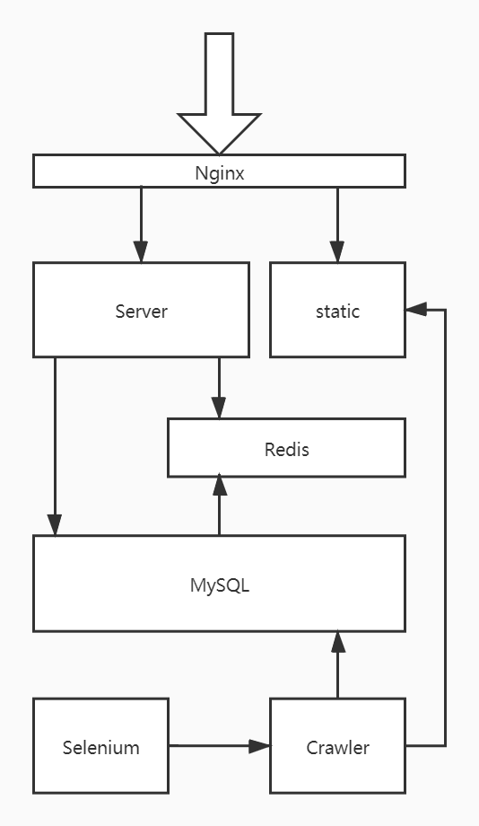

# Monoid

## 什么是Monoid

​	In [abstract algebra](https://en.wikipedia.org/wiki/Abstract_algebra), a branch of [mathematics](https://en.wikipedia.org/wiki/Mathematics), a **monoid** is an [algebraic structure](https://en.wikipedia.org/wiki/Algebraic_structure) with a single [associative](https://en.wikipedia.org/wiki/Associative) [binary operation](https://en.wikipedia.org/wiki/Binary_operation) and an [identity element](https://en.wikipedia.org/wiki/Identity_element).

​	抽象代数中一个特殊的数学结构被称为 **monoid** , 中文翻译为**幺半群** 或者 **独异点**. 项目开始时,[alisdlyc](https://github.com/alisdlyc) 同学敏锐的捕捉到了 **独异点**与**读一点**的谐音, 于是这个项目就被命名为了**Monoid**.

## Monoid 是什么

Monoid是一款基于蓝牙定位和推荐算法的周边好书App. 规划了以下几个功能:

- 蓝牙点获取用户位置信息
- 新书上架版面实现新书、新刊上新信息公布
- 在书籍检索版面实现“图书检索机“基本功能的情况下，每本书下增加优质评论、推荐指数等信息。
- 在每个书架上附上扫描二维码查看推荐的功能，扫描出本架书上所有书籍信息及其推荐评论。

## 哪里能获取到

​	很遗憾,由于开发时间比较紧张, Android客户端上线之后已经很久没有维护了,目前暂不可用,但是后端接口仍然保留,且我仍然在进行维护更新,未来会有网页版和客户端的版本,请拭目以待.

## 项目组织

项目的组织结构一直在演进,这是目前的状态:

## 模块介绍

### Selenium

负责从[北京邮电大学图书检索系统](http://opac.bupt.edu.cn:8080/index.html) 获取所有书籍的页面链接,然后传递给Crawler模块. 使用了**生产者-消费者**模式.

Selenium 模块可以部署在Windows或者Linux下. 

### Crawler

负责从**缓冲区** 得到书籍的页面链接,然后进行抓取解析写入数据库,同时承担了一部分数据更新的任务. 使用 **生产者-消费者**模式,生产者获得`Document`对象,然后传递给`Parser`. IO密集型任务使用线程池实现.

### Server

负责响应用户的请求